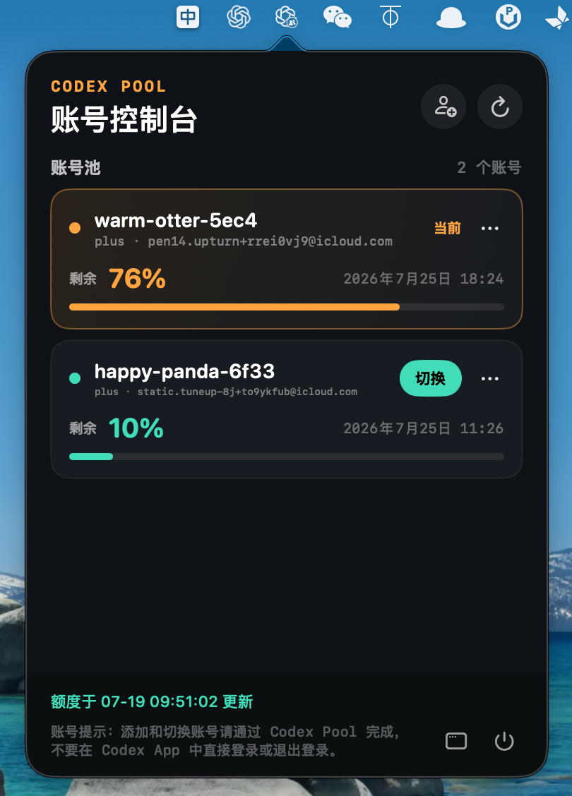

# Codex Pool

Codex Pool 是一个面向 macOS 的本地 Codex 多账号管理工具，支持账号导入、官方登录、额度查看和安全切换。

v0.1.2 起，添加和切换账号直接使用 `CODEX_HOME/auth.json`，不再要求在
`config.toml` 中显式配置 `cli_auth_credentials_store = "file"`。

想了解实现原理、工程结构、CLI 细节和 macOS 构建过程，请阅读[项目技术文档](docs/PROJECT_DOCUMENTATION.md)。

## macOS App

CodexPoolMemu 是一个常驻 macOS 菜单栏的账号控制台，支持：

- 查看账号池、当前账号、套餐和额度；
- 添加账号并通过官方登录流程完成导入；
- 在退出 Codex App 后切换账号；
- 刷新额度、重命名账号和清理不再使用的账号。



### 下载

前往 [GitHub Releases](https://github.com/zhjingh2/CodexPool/releases) 下载最新版本：

[下载 CodexPoolMemu v0.1.2（Intel + Apple Silicon）](https://github.com/zhjingh2/CodexPool/releases/download/v0.1.2/CodexPoolMemu-0.1.2-macos-universal.zip)

解压后将 `CodexPoolMemu.app` 拖入“应用程序”文件夹即可。

当前发布包为 Universal 架构，同时支持 Intel `x86_64` 和 Apple Silicon `arm64` Mac。运行还需要 macOS、Node.js 20+ 和 Codex CLI。当前版本尚未进行 Apple Developer ID 签名和公证，首次打开时可能需要在“系统设置 > 隐私与安全性”中允许运行。

## 从源码运行

```bash
npm install
npm test
npm run menu
```

构建独立 App：

```bash
npm run menu:app
open .build/CodexPoolMemu.app
```

## CLI 常用操作

所有命令都可以在项目根目录执行。首次使用建议先运行环境检查：

```bash
npm run doctor
```

### 账号管理

导入当前 Codex 账号：

```bash
node dist/src/cli/main.js account add work
```

通过官方登录添加新账号：

```bash
node dist/src/cli/main.js account login personal
```

查看账号列表和额度：

```bash
node dist/src/cli/main.js account list
node dist/src/cli/main.js account list --refresh
```

重命名账号：

```bash
node dist/src/cli/main.js account rename work company
```

清理不再使用的账号：

```bash
node dist/src/cli/main.js account purge personal
```

清理操作不可恢复，只能重新登录添加该账号。

### 切换账号

切换前请退出 Codex App 和 app-server：

```bash
node dist/src/cli/main.js switch company
node dist/src/cli/main.js switch company --launch
```

`--launch` 会在切换完成后尝试重新打开 Codex App。

## 登录后自动启动

安装并启用登录启动：

```bash
npm run menu:install
```

移除自动启动和已安装的 App：

```bash
npm run menu:uninstall
```

## 数据与安全

- 账号数据默认保存在 `~/.codex-pool/`，账号凭证仅保存在本机，不会上传到 GitHub；
- 程序不会在列表或日志中输出 token，账号指纹只保存哈希；
- 账号切换属于冷切换操作，需要先退出 Codex App 和 app-server；
- 不要将 `~/.codex/auth.json`、`~/.codex-pool/` 或其他真实凭证提交到 GitHub。
