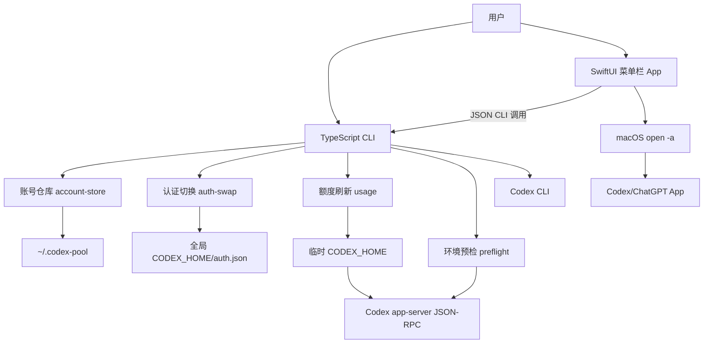
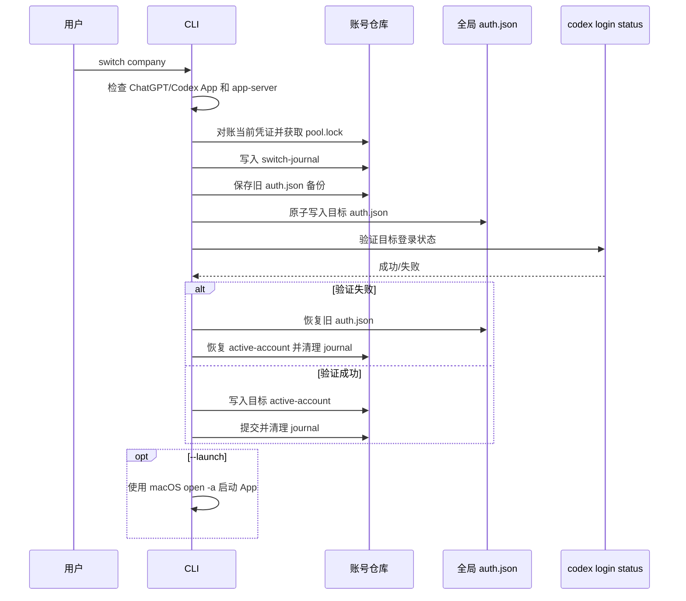
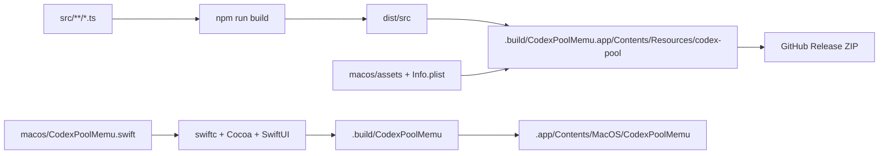

# Codex Pool 项目技术文档

> 版本：`0.1.0`  
> 当前状态：CLI、额度查询和 macOS 菜单栏 App 已可用  
> 支持平台：macOS  
> 文档依据：当前源码、测试和构建脚本

## 1. 项目介绍

Codex Pool 是一个本地运行的 Codex 多账号管理工具。它不提供账号服务器，也不把凭证上传到远端，而是在用户自己的 Mac 上保存多个账号的凭证副本，并在需要时把指定账号切换为 Codex 当前使用的全局账号。

项目提供两种入口：

1. **CLI**：适合初始化环境、脚本化操作、排查问题和执行完整命令集；
2. **CodexPoolMemu**：原生 SwiftUI 菜单栏 App，适合查看账号状态、刷新额度、登录、重命名、删除和切换账号。

项目的核心定位是“安全的冷切换”，不是在 Codex App 运行期间热替换登录状态。切换账号前，程序会要求退出 Codex App 和 app-server，完成认证文件替换和登录校验后，再按需重新打开 Codex App。

## 2. 设计目标与边界

### 2.1 目标

- 保存多个账号的独立凭证副本和展示元数据；
- 使用官方 `codex login` 完成新增账号登录；
- 展示套餐、额度百分比、重置时间和账号健康状态；
- 在更新全局 `auth.json` 前创建备份，并通过原子写入降低损坏风险；
- 在切换过程中使用锁和 journal，避免并发操作或进程中断留下不一致状态；
- 不在列表、日志和元数据中输出 access token、refresh token 或 ID token；
- 通过本地 Codex app-server 获取账号和用量信息，而不是直接调用私有网络接口。

### 2.2 非目标和当前限制

- 仅支持 macOS；
- 目前要求 Codex 使用文件凭证模式：`cli_auth_credentials_store = "file"`；
- 不支持 Codex App 运行期间的热切换；
- 不实现账号自动轮换、并发使用或平台限制绕过；
- 不删除共享的 Codex 会话、项目、插件或 SQLite 状态；
- 当前预编译 Release 为 Intel `x86_64`，需要用户安装 Node.js 20+ 和 Codex CLI；
- 当前 App 未进行 Apple Developer ID 签名和公证；
- app-server 接口属于实验性协议，未来 Codex 版本升级可能需要适配。

## 3. 总体架构



### 3.1 主要数据流

- **导入当前账号**：读取 `CODEX_HOME/auth.json`，验证文件凭证和登录状态，计算账号指纹，然后复制到账号仓库；
- **登录新账号**：创建隔离的临时 `CODEX_HOME`，调用官方 `codex login`，登录成功后再将临时凭证导入账号仓库，最后清理临时目录；
- **查看账号**：读取元数据和凭证健康状态，并将全局 `auth.json` 的真实指纹与 `active-account` 对账；
- **刷新额度**：为每个账号创建独立临时运行目录，启动短生命周期 app-server，通过 JSON-RPC 获取账号、额度和用量，必要时写回刷新后的凭证和元数据；
- **切换账号**：检查进程、获取锁、写入 journal、备份当前凭证、原子替换目标凭证、运行 `codex login status` 验证、更新 `active-account`，最后按需启动 App。

## 4. 工程组织形式

```text
CodexPool/
├── src/
│   ├── account-store/       账号目录、元数据、凭证和锁
│   ├── app-server/          app-server JSON-RPC 客户端
│   ├── auth-swap/           全局 auth.json 冷切换
│   ├── cli/                 命令解析和终端输出
│   ├── core/                通用类型
│   ├── preflight/           环境、配置和进程预检
│   ├── runtime/             隔离登录运行时
│   ├── security/            敏感信息脱敏
│   ├── transaction/         switch journal 和恢复
│   └── usage/               额度刷新和缓存写回
├── macos/
│   ├── CodexPoolMemu.swift  SwiftUI 菜单栏 App
│   ├── Info.plist           App Bundle 元信息
│   ├── build-app.sh         App Bundle 构建脚本
│   ├── install-login.sh     安装 App 和 LaunchAgent
│   ├── uninstall-login.sh   移除 App 和 LaunchAgent
│   └── assets/              菜单栏图标和 App 图标
├── tests/                   Node 内置 test runner 测试
├── docs/                    项目文档和 README 截图
├── release/                 仓库内预编译 App Bundle
├── package.json             npm 脚本和依赖
└── tsconfig.json            TypeScript 编译配置
```

### 4.1 TypeScript 编译结构

`tsconfig.json` 使用严格模式、ES2022、NodeNext 模块解析，并把 `src/**/*.ts` 和 `tests/**/*.ts` 编译到 `dist/`。生成内容包括：

- JavaScript 文件：运行 CLI 和测试；
- `.d.ts`：类型声明；
- `.js.map`：源码映射，便于调试。

`package.json` 的 `bin` 将 `codex-pool` 指向 `dist/src/cli/main.js`。App Bundle 内也会嵌入一份 `dist/src` 和 `package.json`，因此运行时不依赖当前终端所在目录。

### 4.2 npm 脚本

| 脚本 | 作用 |
| --- | --- |
| `npm run build` | 编译 TypeScript 到 `dist/` |
| `npm run check` | 只做 TypeScript 类型检查，不写入构建产物 |
| `npm test` | 编译并运行 `dist/tests/*.test.js` |
| `npm run doctor` | 编译后运行 `codex-pool doctor` |
| `npm run menu:build` | 编译 Swift 菜单栏可执行文件到 `.build/` |
| `npm run menu:app` | 编译 CLI 并生成 `.app` Bundle |
| `npm run menu` | 编译 CLI、Swift 可执行文件并直接运行菜单栏 App |
| `npm run menu:install` | 构建 App，安装到 `~/Applications` 并启用登录启动 |
| `npm run menu:uninstall` | 移除登录启动和已安装 App |

## 5. 本地数据模型

### 5.1 目录布局

默认账号仓库位于 `~/.codex-pool/`，也可以用 `CODEX_POOL_HOME` 指定其他路径：

```text
~/.codex-pool/
├── pool.lock
├── active-account
├── switch-journal.json
├── accounts/
│   ├── work/
│   │   ├── auth.json
│   │   └── metadata.json
│   └── personal/
│       ├── auth.json
│       └── metadata.json
└── runtime/
    ├── login/<run-id>/
    ├── <alias>/run-<uuid>/
    └── switch/<transaction-id>/
```

其中：

- `active-account` 是当前账号别名的显示标记，不是认证事实来源；
- `accounts/<alias>/auth.json` 是该账号的本地凭证副本；
- `metadata.json` 只保存账号身份指纹、展示信息、额度缓存和登录状态；
- `pool.lock` 防止多个写操作同时修改账号仓库；
- `switch-journal.json` 用于切换中断后的恢复；
- `runtime/` 只保存短期运行时文件，任务结束后删除。

默认权限约束：目录 `0700`，凭证和元数据文件 `0600`。程序拒绝使用符号链接形式的账号目录、`auth.json` 或 `active-account`。

### 5.2 `metadata.json` 字段

当前类型定义见 `src/account-store/types.ts`：

| 字段 | 说明 |
| --- | --- |
| `schemaVersion` | 元数据格式版本，目前为 `1` |
| `alias` | 用户使用的账号别名 |
| `accountFingerprint` | 由账号标识计算的 SHA-256 指纹，不保存原始账号标识 |
| `authMode` | `auth.json` 中的认证模式 |
| `email` / `emailMasked` | 已验证邮箱及脱敏显示值 |
| `planType` | 套餐类型 |
| `primaryQuota` / `secondaryQuota` | 额度窗口、剩余比例和重置时间 |
| `usageStatus` / `usageMessage` | token 用量查询状态 |
| `needsRelogin` / `reloginReason` | 凭证失效后的重新登录标记 |
| `addedAt` / `updatedAt` / `lastRefreshedAt` | 生命周期和刷新时间 |

`metadata.json` 不应包含 access token、refresh token、ID token 或其他完整凭证内容。

## 6. CLI 能力

CLI 入口为：

```bash
node dist/src/cli/main.js <command>
```

完成 `npm run build` 后，也可以使用 npm 暴露的 `codex-pool` 命令。

### 6.1 帮助和版本

```bash
codex-pool --help
codex-pool --version
```

`--help` 输出命令用法，`--version` 输出当前版本 `0.1.0`。

### 6.2 `doctor [--json]`

用于检查当前机器是否满足运行条件。检查项目包括：

1. 当前平台是否为 macOS；
2. `codex` 命令是否可执行及其版本；
3. `CODEX_HOME` 是否存在；
4. `auth.json` 是否存在、权限是否安全；
5. `cli_auth_credentials_store` 是否显式为 `file`；
6. 当前登录状态是否有效；
7. ChatGPT/Codex App 和 app-server 是否仍在运行；
8. app-server 是否提供 `account/read`、`account/rateLimits/read`、`account/usage/read`；
9. 是否残留未完成的切换 journal。

默认输出人类可读报告，`--json` 输出机器可读报告。存在 `fail` 检查时退出码为 `1`，否则为 `0`。

### 6.3 `account add <alias> [--json]`

将当前全局 Codex 账号导入账号池。

执行逻辑：

1. 校验别名格式并阻止路径穿越；
2. 检查 `config.toml` 中的文件凭证模式；
3. 运行 `codex login status` 确认当前账号可用；
4. 检查 `auth.json` 是否是权限安全的普通文件；
5. 解析 JSON，验证 `account_id`、access token 和 refresh token；
6. 由 `account_id` 计算 SHA-256 指纹；
7. 拒绝重复别名和已被其他别名保存的同一账号；
8. 原子写入账号目录中的 `auth.json` 和 `metadata.json`；
9. 默认更新 `active-account`。

该命令只读取并复制当前凭证，不要求退出 Codex App；但后续 `switch` 仍然要求退出 Codex App 和 app-server。

### 6.4 `account login <alias>`

通过官方 `codex login` 添加或重新登录账号。

实现方式是创建 `~/.codex-pool/runtime/login/<run-id>/`，写入最小配置 `cli_auth_credentials_store = "file"`，并以该目录作为临时 `CODEX_HOME` 启动官方登录流程。登录成功后导入临时凭证，登录取消或失败时不改变当前全局账号。无论成功或失败，临时目录都会在 `finally` 中清理。

当目标别名已经存在且被标记为 `needsRelogin` 时，登录成功后可以更新该账号；如果账号指纹不同，程序拒绝覆盖，避免把错误账号写入旧别名。

### 6.5 `account list [--refresh] [--force] [--json]`

读取账号池并输出账号摘要，包括别名、套餐、凭证健康状态、用量状态、当前标记、额度百分比和重置时间。

- 默认模式只读取元数据和本地凭证健康状态，返回较快；
- `--refresh` 刷新凭证正常且超过 5 分钟未刷新缓存的账号；
- `--force` 与 `--refresh` 一起使用时忽略 5 分钟缓存；
- 多账号刷新最多并发 3 个，每个账号使用独立临时 `CODEX_HOME`；
- `--json` 输出结构化 `AccountSummary[]`，供菜单栏 App 消费；
- 某个账号刷新失败时，其他账号仍可能成功写回，命令最终以退出码 `1` 表示存在失败。

列表读取前会将全局 `auth.json` 的指纹与账号池中的账号对账：如果匹配到已保存账号，会同步更新该账号凭证并更新 `active-account`；如果是未知账号或全局凭证已经消失，则清除过期的当前标记，但不会自动创建账号。

### 6.6 `account rename <from> <to>`

在锁保护下移动账号目录，并同步修改 `metadata.json` 中的 `alias`。凭证、账号指纹、额度缓存和当前状态保持不变；如果源账号不存在、目标别名已存在或别名非法，操作失败。

### 6.7 `account purge <alias>`

永久删除非当前账号目录中的 `auth.json`、`metadata.json` 和额度缓存。CLI 交互模式要求输入完全匹配的别名，脚本环境可以传入：

```bash
codex-pool account purge personal --confirm personal
```

当前账号受到保护，必须先切换到其他账号。该操作不删除共享 Codex 会话、项目或插件状态，且删除后只能重新登录恢复。

### 6.8 `switch <alias> [--launch]`

执行安全冷切换。核心步骤如下：



切换的安全点：

- 检测到桌面 App 或 app-server 运行时直接拒绝；
- 目标凭证必须与目标元数据中的指纹一致；
- 当前账号和目标账号文件都必须是普通私有文件；
- 认证替换、登录校验和 `active-account` 更新通过 journal 记录阶段；
- 目标校验失败时回滚旧认证和当前标记；
- `--launch` 只影响切换后的打开 App，不影响已提交的认证切换。

### 6.9 CLI 退出码

| 退出码 | 含义 |
| --- | --- |
| `0` | 命令成功 |
| `1` | 运行时、环境、凭证或外部命令失败 |
| `2` | 参数、命令或选项使用错误 |

## 7. 额度与 app-server 原理

### 7.1 为什么使用临时 `CODEX_HOME`

非当前账号的凭证不能直接覆盖用户正在使用的全局 `~/.codex`。刷新时程序为每个账号创建独立目录：

```text
~/.codex-pool/runtime/<alias>/run-<uuid>/
├── auth.json
└── config.toml
```

该目录只包含当前查询所需的凭证和文件凭证配置，不长期保存 Codex 会话、SQLite 或项目状态。查询完成后整个目录被删除。

### 7.2 JSON-RPC 请求顺序

`src/app-server/index.ts` 启动：

```bash
codex app-server --stdio
```

随后通过 stdin/stdout 进行换行分隔的 JSON-RPC 通信：

1. `initialize`：声明 `codex-pool` 客户端和实验性 API 能力；
2. 接收初始化响应后发送 `initialized` 通知；
3. `account/read`：读取邮箱和套餐；
4. 如果账号暂时为空，短暂等待后带 `refreshToken: true` 重试；
5. `account/rateLimits/read`：读取主、次额度窗口；
6. `account/usage/read`：读取累计和每日 token 用量；
7. 等待结果或超时，并确保子进程退出后再清理临时目录。

额度接口会对短暂失败进行有限重试。用量接口不可用时，仍保留已取得的账号和额度结果，并将 `usageStatus` 标记为 `unavailable`。所有错误文本在进入日志或终端前都经过脱敏处理。

### 7.3 凭证刷新写回

app-server 可能在查询期间刷新 refresh token。程序会：

1. 检查刷新后的 `auth.json` 仍然属于同一账号指纹；
2. 在写回前重新取得账号锁；
3. 再次确认账号元数据和原始凭证没有被其他操作修改；
4. 仅在校验通过时原子写回新凭证和额度元数据；
5. 如果账号在查询期间发生切换、重命名或重新登录，则放弃旧结果，避免覆盖新状态。

## 8. macOS App 实现

### 8.1 UI 和进程模型

`macos/CodexPoolMemu.swift` 是一个原生 SwiftUI 菜单栏 App：

- 使用 `NSStatusItem` 创建菜单栏图标；
- 使用 `NSPopover` 展示约 `370 × 515` 的账号面板；
- 设置 `NSApp.setActivationPolicy(.accessory)`，不在 Dock 中显示普通主窗口；
- 打开面板时刷新账号列表和额度；
- 通过 `Process` 启动 `/usr/bin/env node <cliPath> <arguments>`；
- 使用 `account list --json` 解析 CLI 输出；
- 切换使用 `switch <alias> --launch`；
- 添加新账号使用 `account login <generated-alias>`；
- 凭证失效时使用相同别名重新登录；
- 重命名和清理操作直接复用 CLI；
- 点击面板外部时主动收起 popover。

App 不重复实现账号存储和认证逻辑，Swift 层只负责展示状态、收集操作并调用 TypeScript CLI。这样 CLI 和 App 共用一套安全校验、锁、回滚和错误处理。

### 8.2 CLI 路径解析

App 按以下优先级确定项目根目录和 CLI：

1. `CODEX_POOL_ROOT`：显式指定项目或 Bundle 根目录；
2. 从可执行文件路径推导项目根目录；
3. Bundle 内的 `Contents/Resources/codex-pool`；
4. 当前工作目录作为最后回退。

CLI 路径优先使用 `CODEX_POOL_CLI`，否则使用项目根目录下的 `dist/src/cli/main.js`。App 还会把 Homebrew、npm 全局目录和常见本地 bin 目录加入 PATH，以降低 Finder/LaunchAgent 环境缺少 PATH 的问题。

### 8.3 诊断日志

Swift 层会记录 CLI 操作名称、退出码和脱敏后的错误摘要到：

```text
~/Library/Logs/CodexPool/CodexPoolMemu.diagnostic.log
```

日志目录权限为 `0700`，日志文件权限为 `0600`。记录前会清理邮箱、Bearer token、JWT 和常见 token 字段；诊断失败不会阻断账号操作。

## 9. macOS App 构建过程

### 9.1 构建链路



### 9.2 `npm run menu:build`

该脚本：

```bash
swiftc -O -parse-as-library \
  -module-cache-path .build/module-cache \
  -o .build/CodexPoolMemu \
  macos/CodexPoolMemu.swift \
  -framework Cocoa \
  -framework SwiftUI
```

它只生成 Swift 可执行文件，不包含 TypeScript CLI 和资源。

### 9.3 `npm run menu:app`

该命令先运行 TypeScript 构建，再调用 `macos/build-app.sh`：

1. 删除旧的 `.build/CodexPoolMemu.app` 并创建 Bundle 目录；
2. 编译 Swift 可执行文件到 `Contents/MacOS/CodexPoolMemu`；
3. 复制 `macos/Info.plist`；
4. 复制 `package.json`、`dist/src` 和图标资源到 `Contents/Resources/codex-pool/`；
5. 使用 `sips` 将菜单栏图标调整为多种尺寸；
6. 使用 `iconutil` 生成 `CodexPoolMemu.icns`，失败时使用仓库中的预生成图标；
7. 设置 App 可执行文件权限为 `0755`。

生成结果：

```text
.build/CodexPoolMemu.app/
├── Contents/
│   ├── Info.plist
│   ├── MacOS/CodexPoolMemu
│   └── Resources/
│       ├── CodexPoolMemu.icns
│       └── codex-pool/
│           ├── package.json
│           ├── dist/src/
│           └── macos/assets/
```

当前 Bundle 只内置项目自身的 Swift 和 JavaScript 代码，不内置 Node.js 或 Codex CLI；用户环境仍需提供这两个运行时依赖。

### 9.4 安装为登录启动 App

`npm run menu:install` 会：

1. 确认 `.build/CodexPoolMemu.app` 已生成；
2. 将 App 复制到 `~/Applications/CodexPoolMemu.app`；
3. 根据 `macos/com.codexpool.menubar.plist` 生成 LaunchAgent；
4. 保存安装时存在的代理环境变量；
5. 使用 `launchctl bootstrap`、`enable` 和 `kickstart` 立即加载并启动；
6. 将标准输出和错误输出写入 `~/Library/Logs/CodexPool/`。

`npm run menu:uninstall` 会停止并删除 LaunchAgent，同时移除 `~/Applications/CodexPoolMemu.app`。

### 9.5 发布打包

当前项目的发布流程是手动构建和上传：

```bash
npm test
npm run menu:app
mkdir -p dist/releases
ditto -c -k --sequesterRsrc --keepParent \
  .build/CodexPoolMemu.app \
  dist/releases/CodexPoolMemu-0.1.0-macos-x86_64.zip
shasum -a 256 dist/releases/CodexPoolMemu-0.1.0-macos-x86_64.zip \
  > dist/releases/SHA256SUMS.txt
```

然后将 ZIP 和校验文件上传到 GitHub Release。仓库当前已发布的版本位于：

<https://github.com/zhjingh2/CodexPool/releases>

## 10. 安全设计

### 10.1 文件权限与路径安全

- 账号仓库、账号目录和 runtime 目录使用 `0700`；
- `auth.json`、`metadata.json`、锁文件和 journal 使用 `0600`；
- 别名只允许字母、数字、`.`、`_`、`+`、`@` 和 `-`，长度为 1–128；
- `.`、`..`、`runtime`、`accounts` 是保留别名；
- 账号目录和认证文件拒绝符号链接；
- `auth.json` 大小超过 1 MiB 时拒绝导入；
- 原子写入会先创建同目录临时文件，写入、`fsync` 后再 `rename`。

### 10.2 凭证泄露防护

`src/security/redact.ts` 会脱敏：

- `access_token`、`refresh_token`、`id_token`；
- `api_key`、`authorization`、`password`、`secret`；
- Bearer token；
- JWT 三段式字符串。

账号指纹只由 `account_id` 的 SHA-256 结果构成，终端列表和 JSON 输出不会返回原始 token 字段。

### 10.3 并发和崩溃恢复

所有会改变账号仓库的操作使用 `pool.lock`。锁文件中记录 PID 和创建时间；发现锁已存在时，程序会尝试判断原 PID 是否仍存活，只有确认锁为陈旧锁时才允许清理。

切换使用阶段 journal：

```text
prepared
  → auth-replaced
  → verified
  → active-updated
  → committed
```

下次执行切换时，如果发现未完成 journal，会先验证 journal 路径属于当前账号仓库，再根据阶段恢复旧认证或清理已提交事务。

## 11. 测试与质量保证

测试使用 Node.js 内置 `node:test`，测试文件按模块组织：

| 文件 | 覆盖范围 |
| --- | --- |
| `account-store.test.ts` | 别名、指纹、权限、导入、重复账号 |
| `list.test.ts` | 列表、凭证状态、外部登录对账 |
| `login.test.ts` | 隔离登录、取消、重新登录 |
| `maintenance.test.ts` | 重命名、当前账号保护、清理 |
| `switch.test.ts` | 原子切换、验证失败回滚、journal 恢复、进程保护 |
| `usage.test.ts` | 临时运行时、额度写回、邮箱回退、重新登录标记、并发刷新 |
| `app-server.test.ts` | JSON-RPC 顺序、重试、用量降级、子进程关闭 |
| `preflight.test.ts` | 环境检查、凭证模式、权限、进程摘要和脱敏 |

运行：

```bash
npm test
```

测试通过后再执行 `npm run menu:app` 进行 App Bundle 构建。由于菜单栏 UI 和真实 Codex app-server 依赖 macOS 环境，完整发布前仍应进行一次手工验收：打开 App、登录一个测试账号、刷新额度、切换账号，再确认失败场景不会破坏旧凭证。

## 12. 常见问题与排查

### `FILE_STORE_REQUIRED`

Codex 当前没有显式使用文件凭证模式。编辑 `CODEX_HOME/config.toml`，加入：

```toml
cli_auth_credentials_store = "file"
```

然后重新运行 `npm run doctor`。

### `CODEX_RUNNING`

切换时检测到 ChatGPT/Codex App 或 app-server 仍在运行。完全退出相关 App 和后台进程后再执行 `switch`。

### `ACCOUNT_NEEDS_RELOGIN`

该账号的额度查询或认证请求表明凭证已失效。使用同一个别名执行：

```bash
codex-pool account login <alias>
```

登录成功后再刷新列表。

### Swift 编译出现旧 module cache 路径

如果项目目录曾被移动，`.build/module-cache` 可能包含旧路径。可以将该缓存目录改名或清理后重新运行：

```bash
mv .build/module-cache .build/module-cache.stale
mkdir -p .build/module-cache
npm run menu:app
```

### App 可以打开但找不到 `node` 或 `codex`

Finder 和 LaunchAgent 的 PATH 通常比终端短。确认 Node.js 和 Codex CLI 已安装，并检查 `/opt/homebrew/bin`、`/usr/local/bin`、`~/.npm-global/bin` 或 `~/.local/bin` 是否包含在 PATH 中。也可以通过 `CODEX_POOL_ROOT` 和 `CODEX_POOL_CLI` 显式指定项目根目录及 CLI 文件。

## 13. 后续演进方向

- 构建 Universal 或 Apple Silicon 原生版本；
- 接入 Apple Developer ID 签名和公证；
- 将发布流程迁移到 GitHub Actions；
- 在兼容的情况下支持系统钥匙串，而不是只支持文件凭证；
- 为 app-server 协议增加版本检测和适配层；
- 增加更明确的迁移工具，用于变更 `metadata.json` schema；
- 增加端到端 macOS UI 测试和真实 app-server 验收脚本。
